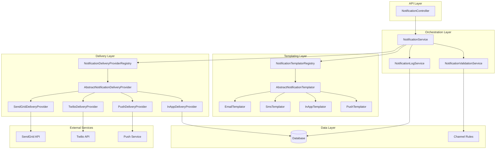
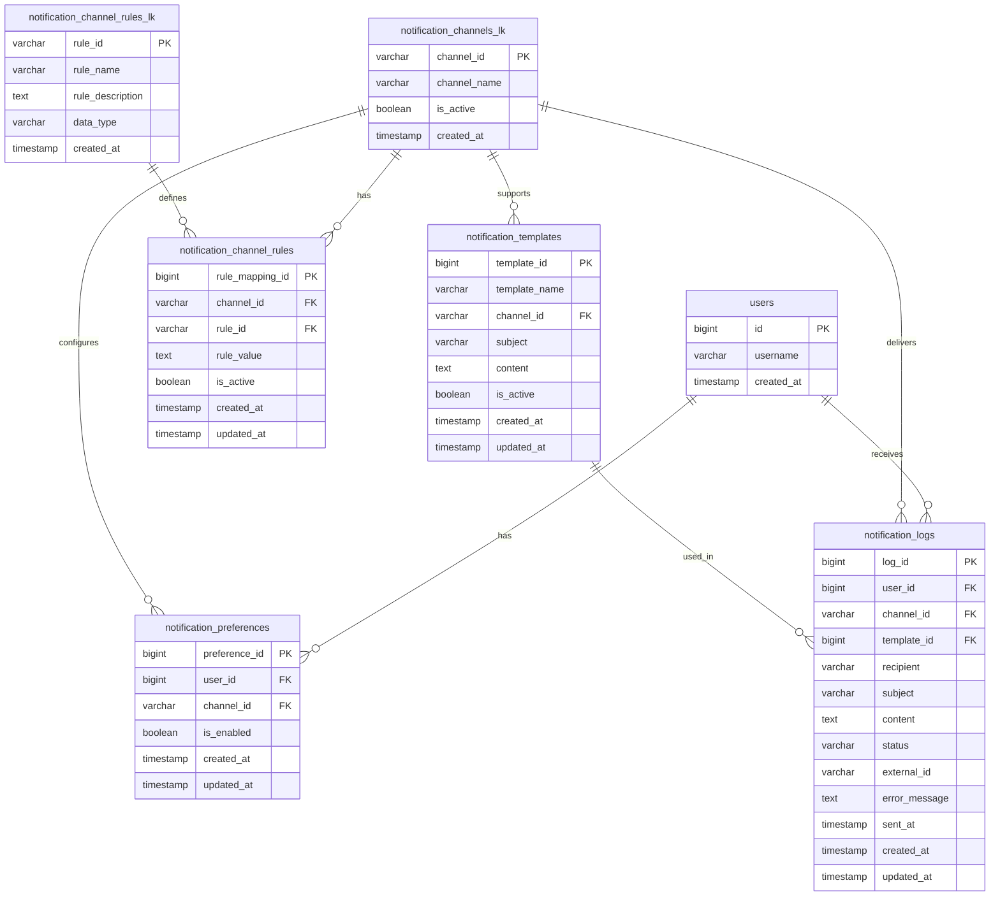
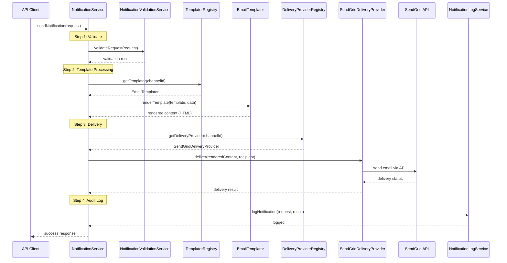

# Notification Infrastructure Implementation Guide

> **Generated by**: Cursor AI Assistant  
> **Created**: 2025-01-27  
> **Last Updated**: 2025-01-27  
> **Status**: Planning - Architecture Refined

## 🎯 Objective
Design and implement a comprehensive notification infrastructure that supports multiple delivery channels (SMS, Email, In-App) with configurable channel rules and **separate templating and delivery concerns**.

## 🔍 Introspective Analysis

### Business Requirements
- **Primary Goal**: Enable notifications through multiple channels with channel-specific templating
- **Success Criteria**: 
  - Clean separation between templating logic and delivery logic
  - Channel-specific template processing (HTML for email, plain text for SMS)
  - Configurable rules/constraints per channel
  - Audit trail for notification delivery status
- **User Impact**: Users receive properly formatted notifications via their preferred method

### Technical Analysis
- **Integration Points**: 
  - User system (existing UserService)
  - Database layer (MyBatis integration)
  - External APIs (SMS providers, Email services)
- **Dependencies**: 
  - Existing provider pattern architecture
  - Channel rules system
  - Template processing libraries (per channel)
- **Constraints**: 
  - Channel-specific formatting requirements
  - Template complexity varies by channel
  - Must integrate with existing patterns

## 📋 Implementation Checklist

### Phase 1: Database & Schema
- [ ] **Database Migration**: Create notification tables
  - [ ] notification_channels_lk table
  - [ ] notification_channel_rules_lk table
  - [ ] notification_channel_rules table
  - [ ] notification_templates table
  - [ ] notification_logs table  
  - [ ] notification_preferences table
- [ ] **MyBatis Integration**: Generate mappers and models

### Phase 2: Templating Architecture
- [ ] **Abstract Templator**: Create base templating provider
  - [ ] AbstractNotificationTemplator
  - [ ] NotificationTemplatorRegistry
- [ ] **Templator Implementations**: Create channel-specific templators
  - [ ] EmailTemplator (HTML/Rich content)
  - [ ] SmsTemplator (Plain text/Character limits)
  - [ ] InAppTemplator (JSON/Structured data)
  - [ ] PushTemplator (Title/Body with constraints)

### Phase 3: Delivery Provider Architecture
- [ ] **Abstract Delivery Provider**: Create base delivery provider
  - [ ] AbstractNotificationDeliveryProvider
  - [ ] NotificationDeliveryProviderRegistry
- [ ] **Delivery Provider Implementations**: Create service-specific providers
  - [ ] SendGridDeliveryProvider
  - [ ] TwilioDeliveryProvider
  - [ ] InAppDeliveryProvider
  - [ ] PushDeliveryProvider

### Phase 4: Core Services
- [ ] **Orchestration Service**: Main notification coordinator
  - [ ] NotificationService (coordinates templating + delivery)
  - [ ] NotificationValidationService (rule-based validation)
  - [ ] NotificationLogService (audit trail)

## 🏗️ Architecture & Design

### Updated System Architecture

The notification system now has **dual provider architecture**:

- **Templating Layer**: Channel-specific template processing
- **Delivery Layer**: Service-specific delivery mechanisms
- **Orchestration Layer**: Coordinates templating + delivery + validation



### Key Components

#### Templating Providers
- **AbstractNotificationTemplator**: Base templating interface
- **EmailTemplator**: HTML/CSS processing, rich content support
- **SmsTemplator**: Plain text, character counting, truncation logic
- **InAppTemplator**: JSON/structured data, notification object creation
- **PushTemplator**: Title/body extraction, character limits

#### Delivery Providers  
- **AbstractNotificationDeliveryProvider**: Base delivery interface
- **SendGridDeliveryProvider**: Email delivery via SendGrid API
- **TwilioDeliveryProvider**: SMS delivery via Twilio API
- **InAppDeliveryProvider**: Database storage for in-app notifications
- **PushDeliveryProvider**: Push notification service integration

#### Orchestration Services
- **NotificationService**: Main coordinator
- **NotificationValidationService**: Rule-based validation
- **NotificationLogService**: Audit trail and delivery status

### Database Schema Design



### Notification Processing Flow



### Channel Rules & Templating Examples

| Channel | Template Type | Max Body Length | Required Fields | Templating Features |
|---------|---------------|----------------|-----------------|-------------------|
| SMS     | Plain Text    | 160           | phone_number    | Simple substitution |
| EMAIL   | HTML/Rich     | 1,000,000     | email_address   | HTML, CSS, images |
| PUSH    | Title/Body    | 25            | device_token    | Title extraction |
| IN_APP  | JSON/Structured| 5,000         | user_id         | Rich objects, actions |

### High-Level Processing Logic

```
function processNotification(request):
    // Step 1: Validate request against channel rules
    validationResult = validateRequest(request)
    if (!validationResult.isValid):
        return error(validationResult.message)
    
    // Step 2: Process template with channel-specific logic
    templator = templatorRegistry.getTemplator(request.channelId)
    renderedContent = templator.renderTemplate(request.template, request.data)
    
    // Step 3: Deliver via appropriate provider
    deliveryProvider = deliveryProviderRegistry.getProvider(request.channelId)
    deliveryResult = deliveryProvider.deliver(renderedContent, request.recipient)
    
    // Step 4: Log the attempt
    logService.logNotification(request, deliveryResult)
    
    return deliveryResult
```

### Key Data Structures

#### Request Objects

**NotificationRequest** - Main input object
```
NotificationRequest {
    channelId: String          // Use NotificationChannels.EMAIL, etc.
    templateId: Long           // Template to use (from NotificationTemplates constants)
    recipients: List<NotificationRecipient>  // Support batch notifications
    parameters: Map<String, Object>          // Template parameters
    priority: NotificationPriority           // HIGH, NORMAL, LOW
    retemplatePerRecipient: Boolean          // Force re-templating per recipient
    metadata: Map<String, String>            // Additional context
}
```

**NotificationRecipient** - Flexible recipient definition
```
NotificationRecipient {
    recipientType: RecipientType     // USER, EMAIL, PHONE, DEVICE_TOKEN
    recipientId: String              // The actual identifier
    userId: Long                     // For audit trail and preferences (optional)
    parameters: Map<String, Object>  // Recipient-specific parameters (optional)
}
```

**NotificationParameters** - Template parameters
```
// Just use Map<String, Object> directly
// Examples:
// parameters.put("userName", "John Doe");
// parameters.put("orderTotal", 99.99);
// parameters.put("actionButtons", Arrays.asList(...));
```

#### Response Objects

**NotificationResponse** - Main output object
```
NotificationResponse {
    success: Boolean
    notificationId: String               // Unique identifier for tracking
    recipientResults: List<RecipientResult>  // Individual results for batch
    overallStatus: DeliveryStatus        // SENT, PENDING, FAILED, DELIVERED
    totalRecipients: Integer
    successCount: Integer
    failureCount: Integer
    errorMessage: String                 // If completely failed
    deliveryTimestamp: Timestamp
}
```

**RecipientResult** - Individual recipient result
```
RecipientResult {
    recipient: NotificationRecipient
    success: Boolean
    status: DeliveryStatus
    externalId: String           // Provider's tracking ID
    errorMessage: String         // If failed
    deliveryTimestamp: Timestamp
}
```

**NotificationValidationResult** - Validation output
```
NotificationValidationResult {
    isValid: Boolean
    errors: List<ValidationError>
    warnings: List<ValidationWarning>
    appliedRules: List<String>         // Which rules were checked
}
```

#### Internal Processing Objects

**RenderedNotification** - Output from templating layer
```
RenderedNotification {
    channelId: String
    recipient: NotificationRecipient
    subject: String            // For channels that support subjects
    content: String            // Rendered template content
    contentType: String        // "text/plain", "text/html", "application/json"
    attachments: List<NotificationAttachment>  // Pluggable attachment system
    metadata: Map<String, Object>     // Channel-specific data
}
```

**NotificationAttachment** - Flexible attachment handling
```
NotificationAttachment {
    attachmentType: AttachmentType     // FILE_PATH, URL, BASE64, BYTE_ARRAY
    content: Object                    // The actual attachment data
    filename: String                   // Display name
    mimeType: String                   // Content type
    size: Long                         // File size in bytes
    metadata: Map<String, String>     // Additional attachment properties
}
```

**DeliveryResult** - Output from delivery layer
```
DeliveryResult {
    success: Boolean
    deliveryStatus: DeliveryStatus
    externalId: String         // Provider's tracking ID
    errorCode: String          // Provider-specific error code
    errorMessage: String
    deliveryTimestamp: Timestamp
    providerMetadata: Map<String, Object>  // Provider-specific data
}
```

#### Configuration Objects

**NotificationTemplate** - Template definition
```
NotificationTemplate {
    templateId: Long
    templateName: String
    channelId: String
    subject: String            // Template for subject (with variables)
    content: String            // Template content (with variables)
    isActive: Boolean
    variables: List<TemplateVariable>  // Expected variables
    createdAt: Timestamp
    updatedAt: Timestamp
}
```

**ChannelRule** - Rule definition
```
ChannelRule {
    channelId: String
    ruleId: String
    ruleValue: Object          // Could be Integer, Boolean, String, JSON
    dataType: String           // "INTEGER", "BOOLEAN", "STRING", "JSON"
    isActive: Boolean
}
```

**UserNotificationPreference** - User preferences
```
UserNotificationPreference {
    userId: Long
    channelId: String
    isEnabled: Boolean
    quietHours: TimeRange      // Optional: no notifications during these hours
    maxFrequency: Integer      // Optional: max notifications per day
    preferences: Map<String, Object>  // Channel-specific preferences
}
```

#### Enums and Constants

**DeliveryStatus**
```
enum DeliveryStatus {
    PENDING,     // Queued for delivery
    SENT,        // Sent to provider
    DELIVERED,   // Confirmed delivered
    FAILED,      // Failed to deliver
    BOUNCED,     // Bounced back (email)
    REJECTED     // Rejected by provider
}
```

**NotificationPriority**
```
enum NotificationPriority {
    HIGH,        // Immediate delivery
    NORMAL,      // Standard queue
    LOW          // Batch processing
}
```

**RecipientType**
```
enum RecipientType {
    USER,            // userId lookup
    EMAIL,           // Direct email address
    PHONE,           // Phone number for SMS
    DEVICE_TOKEN     // Push notification device token
}
```

**AttachmentType**
```
enum AttachmentType {
    FILE_PATH,       // Local file system path
    URL,             // Remote URL to download
    BASE64,          // Base64 encoded content
    BYTE_ARRAY       // Raw byte array
}
```

#### Constants Classes

**NotificationChannels** - Channel identifiers
```
public class NotificationChannels {
    public static final String EMAIL = "EMAIL";
    public static final String SMS = "SMS";
    public static final String IN_APP = "IN_APP";
    public static final String PUSH = "PUSH";
}
```

**NotificationTemplates** - Template identifiers
```
public class NotificationTemplates {
    public static final Long WELCOME_EMAIL = 1L;
    public static final Long ORDER_CONFIRMATION = 2L;
    public static final Long PASSWORD_RESET = 3L;
    public static final Long SHIPPING_NOTIFICATION = 4L;
    // ... more template constants
}
```

**NotificationProviders** - Provider identifiers
```
public class NotificationProviders {
    public static final String SENDGRID = "sendgrid";
    public static final String TWILIO = "twilio";
    public static final String FIREBASE = "firebase";
    public static final String INTERNAL = "internal";
}
```

### Data Flow Examples

#### Simple Email Notification
```
Request:
{
    "channelId": NotificationChannels.EMAIL,
    "templateId": NotificationTemplates.ORDER_CONFIRMATION,
    "recipients": [
        {
            "recipientType": "EMAIL",
            "recipientId": "user@example.com",
            "userId": 456
        }
    ],
    "parameters": {
        "userName": "John Doe",
        "orderTotal": "$99.99"
    },
    "priority": "NORMAL",
    "retemplatePerRecipient": false
}

Response:
{
    "success": true,
    "notificationId": "notif_789",
    "recipientResults": [
        {
            "recipient": {"recipientType": "EMAIL", "recipientId": "user@example.com"},
            "success": true,
            "status": "SENT",
            "externalId": "sg_msg_abc123",
            "deliveryTimestamp": "2025-01-27T10:30:00Z"
        }
    ],
    "overallStatus": "SENT",
    "totalRecipients": 1,
    "successCount": 1,
    "failureCount": 0
}
```

#### Batch SMS with Per-Recipient Templating
```
Request:
{
    "channelId": NotificationChannels.SMS,
    "templateId": NotificationTemplates.SHIPPING_NOTIFICATION,
    "recipients": [
        {
            "recipientType": "PHONE",
            "recipientId": "+1234567890",
            "userId": 456,
            "parameters": {"trackingNumber": "ABC123"}
        },
        {
            "recipientType": "PHONE", 
            "recipientId": "+0987654321",
            "userId": 789,
            "parameters": {"trackingNumber": "XYZ789"}
        }
    ],
    "parameters": {
        "companyName": "ProLinkLi"
    },
    "retemplatePerRecipient": true,  // Each recipient gets their own tracking number
    "priority": "HIGH"
}

Response:
{
    "success": true,
    "notificationId": "notif_batch_456",
    "recipientResults": [
        {
            "recipient": {"recipientType": "PHONE", "recipientId": "+1234567890"},
            "success": true,
            "status": "SENT",
            "externalId": "twilio_msg_1",
            "deliveryTimestamp": "2025-01-27T10:30:00Z"
        },
        {
            "recipient": {"recipientType": "PHONE", "recipientId": "+0987654321"},
            "success": true,
            "status": "SENT",
            "externalId": "twilio_msg_2",
            "deliveryTimestamp": "2025-01-27T10:30:01Z"
        }
    ],
    "overallStatus": "SENT",
    "totalRecipients": 2,
    "successCount": 2,
    "failureCount": 0
}
```

#### Template Validation Error
```
Request:
{
    "channelId": NotificationChannels.SMS,
    "templateId": 999,  // Non-existent template
    "recipients": [
        {
            "recipientType": "PHONE",
            "recipientId": "+1234567890"
        }
    ],
    "parameters": {"message": "Test"}
}

Validation Result:
{
    "isValid": false,
    "errors": [
        {
            "field": "templateId",
            "message": "Template not found or inactive",
            "templateId": 999
        }
    ],
    "warnings": [],
    "appliedRules": ["TEMPLATE_EXISTS"]
}
```

#### In-App Rich Notification with Attachments
```
Request:
{
    "channelId": NotificationChannels.IN_APP,
    "templateId": NotificationTemplates.WELCOME_EMAIL,
    "recipients": [
        {
            "recipientType": "USER",
            "recipientId": "123",
            "userId": 123
        }
    ],
    "parameters": {
        "title": "Welcome Package",
        "message": "Your welcome package is ready",
        "actions": [
            {"label": "Download Guide", "url": "/download/guide.pdf"},
            {"label": "View Profile", "url": "/profile"}
        ]
    }
}

Rendered Content:
{
    "channelId": "IN_APP",
    "recipient": {"recipientType": "USER", "recipientId": "123"},
    "subject": "Welcome Package",
    "content": "{\"title\":\"Welcome Package\",\"message\":\"Your welcome package is ready\",\"actions\":[...]}",
    "contentType": "application/json",
    "attachments": [
        {
            "attachmentType": "URL",
            "content": "https://example.com/guide.pdf",
            "filename": "welcome-guide.pdf",
            "mimeType": "application/pdf",
            "size": 2048000
        }
    ]
}
```

---
**Implementation Status**: ⏳ Planning - Data structures defined
**Review Required**: Yes - Object structure and data flow validation 