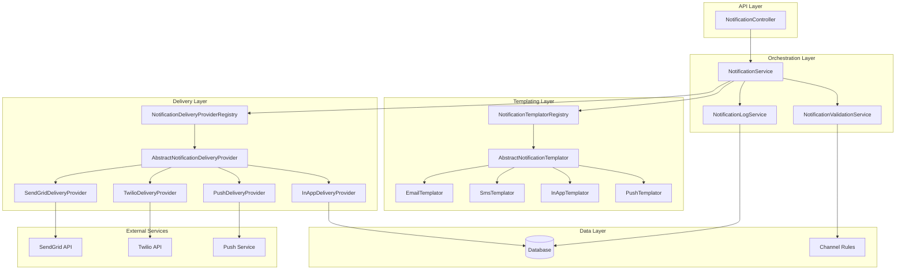
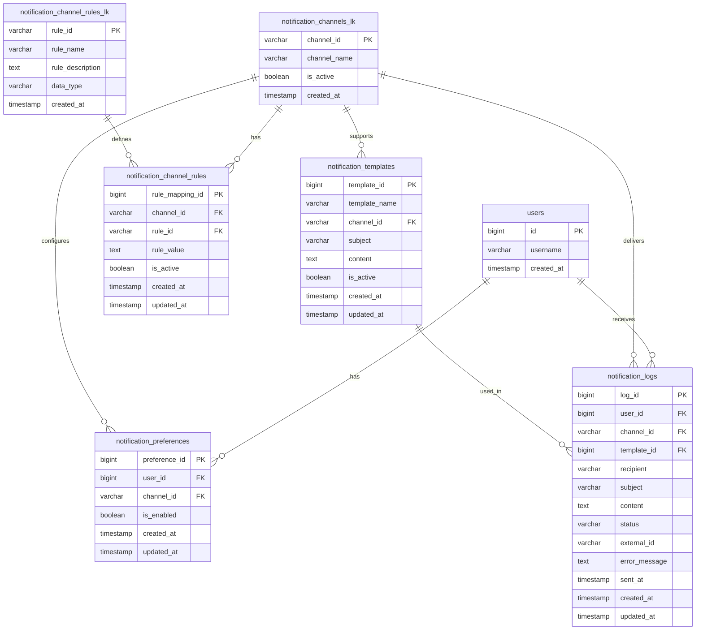
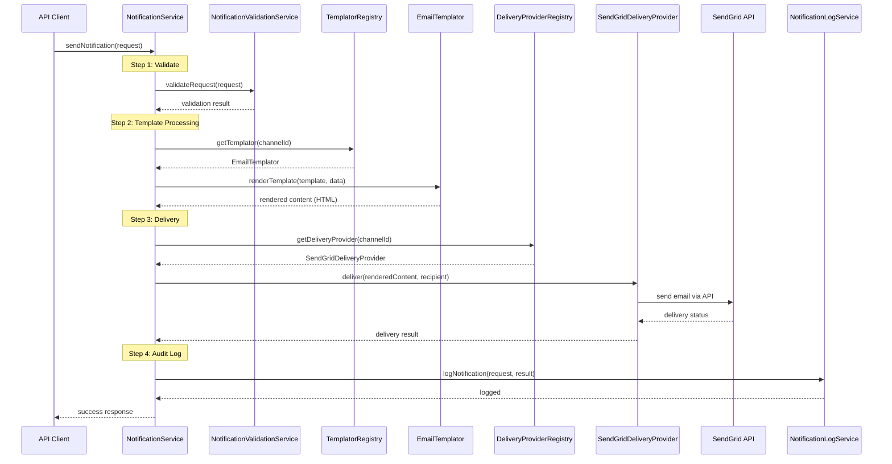

# Notification Infrastructure Implementation Guide

> **Generated by**: Cursor AI Assistant  
> **Created**: 2025-01-27  
> **Last Updated**: 2025-01-27  
> **Status**: Planning - Architecture Refined

## 🎯 Objective
Design and implement a comprehensive notification infrastructure that supports multiple delivery channels (SMS, Email, In-App) with configurable channel rules and **separate templating and delivery concerns**.

## 🔍 Introspective Analysis

### Business Requirements
- **Primary Goal**: Enable notifications through multiple channels with channel-specific templating
- **Success Criteria**: 
  - Clean separation between templating logic and delivery logic
  - Channel-specific template processing (HTML for email, plain text for SMS)
  - Configurable rules/constraints per channel
  - Audit trail for notification delivery status
- **User Impact**: Users receive properly formatted notifications via their preferred method

### Technical Analysis
- **Integration Points**: 
  - User system (existing UserService)
  - Database layer (MyBatis integration)
  - External APIs (SMS providers, Email services)
- **Dependencies**: 
  - Existing provider pattern architecture
  - Channel rules system
  - Template processing libraries (per channel)
- **Constraints**: 
  - Channel-specific formatting requirements
  - Template complexity varies by channel
  - Must integrate with existing patterns

## 📋 Implementation Checklist

### Phase 1: Database & Schema
- [ ] **Database Migration**: Create notification tables
  - [ ] notification_channels_lk table
  - [ ] notification_channel_rules_lk table
  - [ ] notification_channel_rules table
  - [ ] notification_templates table
  - [ ] notification_logs table  
  - [ ] notification_preferences table
- [ ] **MyBatis Integration**: Generate mappers and models

#### Database Table Definitions

**notification_channels_lk** - Channel types lookup
```sql
CREATE TABLE notification_channels_lk (
    channel_id VARCHAR(50) PRIMARY KEY,
    channel_name VARCHAR(100) NOT NULL,
    description TEXT,
    is_active BOOLEAN DEFAULT TRUE,
    created_at TIMESTAMP DEFAULT CURRENT_TIMESTAMP,
    updated_at TIMESTAMP DEFAULT CURRENT_TIMESTAMP ON UPDATE CURRENT_TIMESTAMP
);

-- Insert default channels
INSERT INTO notification_channels_lk (channel_id, channel_name, description) VALUES
('EMAIL', 'Email Notifications', 'HTML/text email notifications via SMTP or API'),
('SMS', 'SMS Notifications', 'Text message notifications via SMS gateway'),
('IN_APP', 'In-App Notifications', 'Rich notifications stored in database for app display'),
('PUSH', 'Push Notifications', 'Mobile push notifications via FCM/APNS');
```

**notification_channel_rules_lk** - Rule types lookup
```sql
CREATE TABLE notification_channel_rules_lk (
    rule_id VARCHAR(50) PRIMARY KEY,
    rule_name VARCHAR(100) NOT NULL,
    rule_description TEXT,
    data_type VARCHAR(20) NOT NULL, -- 'INTEGER', 'STRING', 'BOOLEAN', 'JSON'
    default_value TEXT,
    is_active BOOLEAN DEFAULT TRUE,
    created_at TIMESTAMP DEFAULT CURRENT_TIMESTAMP,
    updated_at TIMESTAMP DEFAULT CURRENT_TIMESTAMP ON UPDATE CURRENT_TIMESTAMP
);

-- Insert default rule types
INSERT INTO notification_channel_rules_lk (rule_id, rule_name, rule_description, data_type) VALUES
('MAX_SUBJECT_LENGTH', 'Maximum Subject Length', 'Maximum characters allowed in subject line', 'INTEGER'),
('MAX_BODY_LENGTH', 'Maximum Body Length', 'Maximum characters allowed in message body', 'INTEGER'),
('SUPPORTS_HTML', 'HTML Support', 'Whether channel supports HTML content', 'BOOLEAN'),
('SUPPORTS_RICH_CONTENT', 'Rich Content Support', 'Whether channel supports rich/structured content', 'BOOLEAN'),
('REQUIRED_FIELDS', 'Required Fields', 'JSON array of required fields for this channel', 'JSON'),
('MAX_RECIPIENT_COUNT', 'Maximum Recipients', 'Maximum number of recipients per message', 'INTEGER'),
('SUPPORTS_ATTACHMENTS', 'Attachment Support', 'Whether channel supports file attachments', 'BOOLEAN'),
('MAX_ATTACHMENT_SIZE', 'Maximum Attachment Size', 'Maximum size per attachment in bytes', 'INTEGER');
```

**notification_channel_rules** - Channel-specific rule values
```sql
CREATE TABLE notification_channel_rules (
    rule_mapping_id BIGINT PRIMARY KEY AUTO_INCREMENT,
    channel_id VARCHAR(50) NOT NULL,
    rule_id VARCHAR(50) NOT NULL,
    rule_value TEXT NOT NULL,
    is_active BOOLEAN DEFAULT TRUE,
    created_at TIMESTAMP DEFAULT CURRENT_TIMESTAMP,
    updated_at TIMESTAMP DEFAULT CURRENT_TIMESTAMP ON UPDATE CURRENT_TIMESTAMP,
    FOREIGN KEY (channel_id) REFERENCES notification_channels_lk(channel_id) ON DELETE CASCADE,
    FOREIGN KEY (rule_id) REFERENCES notification_channel_rules_lk(rule_id) ON DELETE CASCADE,
    UNIQUE KEY unique_channel_rule (channel_id, rule_id)
);

-- Insert default channel rules
INSERT INTO notification_channel_rules (channel_id, rule_id, rule_value) VALUES
-- SMS constraints
('SMS', 'MAX_BODY_LENGTH', '160'),
('SMS', 'SUPPORTS_HTML', 'false'),
('SMS', 'SUPPORTS_RICH_CONTENT', 'false'),
('SMS', 'REQUIRED_FIELDS', '["phone_number"]'),
('SMS', 'MAX_RECIPIENT_COUNT', '1'),
('SMS', 'SUPPORTS_ATTACHMENTS', 'false'),

-- Email constraints
('EMAIL', 'MAX_SUBJECT_LENGTH', '255'),
('EMAIL', 'MAX_BODY_LENGTH', '1000000'),
('EMAIL', 'SUPPORTS_HTML', 'true'),
('EMAIL', 'SUPPORTS_RICH_CONTENT', 'true'),
('EMAIL', 'REQUIRED_FIELDS', '["email_address"]'),
('EMAIL', 'MAX_RECIPIENT_COUNT', '100'),
('EMAIL', 'SUPPORTS_ATTACHMENTS', 'true'),
('EMAIL', 'MAX_ATTACHMENT_SIZE', '25000000'), -- 25MB

-- Push notification constraints
('PUSH', 'MAX_SUBJECT_LENGTH', '50'),
('PUSH', 'MAX_BODY_LENGTH', '25'),
('PUSH', 'SUPPORTS_HTML', 'false'),
('PUSH', 'SUPPORTS_RICH_CONTENT', 'false'),
('PUSH', 'REQUIRED_FIELDS', '["device_token"]'),
('PUSH', 'MAX_RECIPIENT_COUNT', '1'),
('PUSH', 'SUPPORTS_ATTACHMENTS', 'false'),

-- In-app notification constraints
('IN_APP', 'MAX_SUBJECT_LENGTH', '200'),
('IN_APP', 'MAX_BODY_LENGTH', '5000'),
('IN_APP', 'SUPPORTS_HTML', 'true'),
('IN_APP', 'SUPPORTS_RICH_CONTENT', 'true'),
('IN_APP', 'REQUIRED_FIELDS', '["user_id"]'),
('IN_APP', 'MAX_RECIPIENT_COUNT', '1'),
('IN_APP', 'SUPPORTS_ATTACHMENTS', 'true'),
('IN_APP', 'MAX_ATTACHMENT_SIZE', '10000000'); -- 10MB
```

**notification_templates** - Template definitions
```sql
CREATE TABLE notification_templates (
    template_id BIGINT PRIMARY KEY AUTO_INCREMENT,
    template_name VARCHAR(100) NOT NULL,
    template_description TEXT,
    channel_id VARCHAR(50) NOT NULL,
    subject_template VARCHAR(500), -- Template with variables like {{userName}}
    content_template TEXT NOT NULL, -- Template content with variables
    content_type VARCHAR(50) DEFAULT 'text/plain', -- 'text/plain', 'text/html', 'application/json'
    required_variables JSON, -- JSON array of required template variables
    default_variables JSON, -- JSON object of default variable values
    is_active BOOLEAN DEFAULT TRUE,
    created_by BIGINT, -- User who created the template
    created_at TIMESTAMP DEFAULT CURRENT_TIMESTAMP,
    updated_at TIMESTAMP DEFAULT CURRENT_TIMESTAMP ON UPDATE CURRENT_TIMESTAMP,
    FOREIGN KEY (channel_id) REFERENCES notification_channels_lk(channel_id) ON DELETE CASCADE,
    FOREIGN KEY (created_by) REFERENCES users(id) ON DELETE SET NULL,
    INDEX idx_channel_active (channel_id, is_active)
);

-- Insert sample templates
INSERT INTO notification_templates (template_name, template_description, channel_id, subject_template, content_template, content_type, required_variables) VALUES
('Welcome Email', 'Welcome email for new users', 'EMAIL', 'Welcome to {{companyName}}, {{userName}}!', 
 '<h1>Welcome {{userName}}!</h1><p>Thank you for joining {{companyName}}. We''re excited to have you on board.</p>', 
 'text/html', '["userName", "companyName"]'),
 
('Order Confirmation SMS', 'SMS confirmation for orders', 'SMS', NULL, 
 'Hi {{userName}}, your order #{{orderNumber}} for {{orderTotal}} has been confirmed. Track: {{trackingUrl}}', 
 'text/plain', '["userName", "orderNumber", "orderTotal", "trackingUrl"]'),
 
('Password Reset Email', 'Password reset email', 'EMAIL', 'Reset your {{companyName}} password', 
 '<h2>Password Reset</h2><p>Hi {{userName}},</p><p>Click <a href="{{resetUrl}}">here</a> to reset your password.</p><p>This link expires in 1 hour.</p>', 
 'text/html', '["userName", "resetUrl", "companyName"]'),
 
('In-App Order Update', 'In-app notification for order updates', 'IN_APP', 'Order Update', 
 '{"title": "Order {{orderNumber}} Updated", "message": "Your order status is now {{status}}", "actions": [{"label": "View Order", "url": "/orders/{{orderNumber}}"}]}', 
 'application/json', '["orderNumber", "status"]');
```

**notification_logs** - Audit trail of sent notifications
```sql
CREATE TABLE notification_logs (
    log_id BIGINT PRIMARY KEY AUTO_INCREMENT,
    notification_id VARCHAR(100) NOT NULL, -- Our internal tracking ID
    user_id BIGINT, -- User who received the notification (if applicable)
    channel_id VARCHAR(50) NOT NULL,
    template_id BIGINT,
    recipient_type VARCHAR(20) NOT NULL, -- 'USER', 'EMAIL', 'PHONE', 'DEVICE_TOKEN'
    recipient_id VARCHAR(255) NOT NULL, -- The actual recipient identifier
    subject VARCHAR(500), -- Rendered subject
    content TEXT, -- Rendered content
    content_type VARCHAR(50),
    status VARCHAR(50) DEFAULT 'PENDING', -- 'PENDING', 'SENT', 'DELIVERED', 'FAILED', 'BOUNCED', 'REJECTED'
    priority VARCHAR(20) DEFAULT 'NORMAL', -- 'HIGH', 'NORMAL', 'LOW'
    external_id VARCHAR(255), -- Provider's tracking ID (SendGrid message ID, etc.)
    external_provider VARCHAR(50), -- 'sendgrid', 'twilio', 'internal', etc.
    error_code VARCHAR(50), -- Provider-specific error code
    error_message TEXT, -- Error details if failed
    metadata JSON, -- Additional metadata
    sent_at TIMESTAMP NULL, -- When sent to provider
    delivered_at TIMESTAMP NULL, -- When delivery confirmed
    created_at TIMESTAMP DEFAULT CURRENT_TIMESTAMP,
    updated_at TIMESTAMP DEFAULT CURRENT_TIMESTAMP ON UPDATE CURRENT_TIMESTAMP,
    FOREIGN KEY (user_id) REFERENCES users(id) ON DELETE SET NULL,
    FOREIGN KEY (channel_id) REFERENCES notification_channels_lk(channel_id) ON DELETE CASCADE,
    FOREIGN KEY (template_id) REFERENCES notification_templates(template_id) ON DELETE SET NULL,
    INDEX idx_notification_tracking (notification_id),
    INDEX idx_user_notifications (user_id, created_at DESC),
    INDEX idx_channel_status (channel_id, status),
    INDEX idx_external_tracking (external_id, external_provider),
    INDEX idx_status_timestamp (status, sent_at)
);
```

**notification_preferences** - User notification preferences
```sql
CREATE TABLE notification_preferences (
    preference_id BIGINT PRIMARY KEY AUTO_INCREMENT,
    user_id BIGINT NOT NULL,
    channel_id VARCHAR(50) NOT NULL,
    is_enabled BOOLEAN DEFAULT TRUE,
    quiet_hours_start TIME, -- Optional: start of quiet hours (no notifications)
    quiet_hours_end TIME, -- Optional: end of quiet hours
    max_daily_notifications INTEGER, -- Optional: max notifications per day
    preferred_contact_info VARCHAR(255), -- Override default contact info (email, phone, etc.)
    preferences JSON, -- Channel-specific preferences (e.g., email format preference)
    created_at TIMESTAMP DEFAULT CURRENT_TIMESTAMP,
    updated_at TIMESTAMP DEFAULT CURRENT_TIMESTAMP ON UPDATE CURRENT_TIMESTAMP,
    FOREIGN KEY (user_id) REFERENCES users(id) ON DELETE CASCADE,
    FOREIGN KEY (channel_id) REFERENCES notification_channels_lk(channel_id) ON DELETE CASCADE,
    UNIQUE KEY unique_user_channel (user_id, channel_id),
    INDEX idx_user_enabled (user_id, is_enabled)
);

-- Insert default preferences for existing users (optional)
-- This could be part of a separate migration to set default preferences
INSERT INTO notification_preferences (user_id, channel_id, is_enabled)
SELECT u.id, 'EMAIL', TRUE FROM users u
WHERE NOT EXISTS (SELECT 1 FROM notification_preferences np WHERE np.user_id = u.id AND np.channel_id = 'EMAIL');
```

### Phase 2: Templating Architecture
- [ ] **Abstract Templator**: Create base templating provider
  - [ ] AbstractNotificationTemplator
  - [ ] NotificationTemplatorRegistry
- [ ] **Templator Implementations**: Create channel-specific templators
  - [ ] EmailTemplator (HTML/Rich content)
  - [ ] SmsTemplator (Plain text/Character limits)
  - [ ] InAppTemplator (JSON/Structured data)
  - [ ] PushTemplator (Title/Body with constraints)

### Phase 3: Delivery Provider Architecture
- [ ] **Abstract Delivery Provider**: Create base delivery provider
  - [ ] AbstractNotificationDeliveryProvider
  - [ ] NotificationDeliveryProviderRegistry
- [ ] **Delivery Provider Implementations**: Create service-specific providers
  - [ ] SendGridDeliveryProvider
  - [ ] TwilioDeliveryProvider
  - [ ] InAppDeliveryProvider
  - [ ] PushDeliveryProvider

### Phase 4: Core Services
- [ ] **Orchestration Service**: Main notification coordinator
  - [ ] NotificationService (coordinates templating + delivery)
  - [ ] NotificationValidationService (rule-based validation)
  - [ ] NotificationLogService (audit trail)

## 🏗️ Architecture & Design

### Updated System Architecture

The notification system now has **dual provider architecture**:

- **Templating Layer**: Channel-specific template processing
- **Delivery Layer**: Service-specific delivery mechanisms
- **Orchestration Layer**: Coordinates templating + delivery + validation



### Key Components

#### Templating Providers
- **AbstractNotificationTemplator**: Base templating interface
- **EmailTemplator**: HTML/CSS processing, rich content support
- **SmsTemplator**: Plain text, character counting, truncation logic
- **InAppTemplator**: JSON/structured data, notification object creation
- **PushTemplator**: Title/body extraction, character limits

#### Delivery Providers  
- **AbstractNotificationDeliveryProvider**: Base delivery interface
- **SendGridDeliveryProvider**: Email delivery via SendGrid API
- **TwilioDeliveryProvider**: SMS delivery via Twilio API
- **InAppDeliveryProvider**: Database storage for in-app notifications
- **PushDeliveryProvider**: Push notification service integration

#### Orchestration Services
- **NotificationService**: Main coordinator
- **NotificationValidationService**: Rule-based validation
- **NotificationLogService**: Audit trail and delivery status

### Database Schema Design



### Notification Processing Flow



### Channel Rules & Templating Examples

| Channel | Template Type | Max Body Length | Required Fields | Templating Features |
|---------|---------------|----------------|-----------------|-------------------|
| SMS     | Plain Text    | 160           | phone_number    | Simple substitution |
| EMAIL   | HTML/Rich     | 1,000,000     | email_address   | HTML, CSS, images |
| PUSH    | Title/Body    | 25            | device_token    | Title extraction |
| IN_APP  | JSON/Structured| 5,000         | user_id         | Rich objects, actions |

### High-Level Processing Logic

```
function processNotification(request):
    // Step 1: Validate request against channel rules
    validationResult = validateRequest(request)
    if (!validationResult.isValid):
        return error(validationResult.message)
    
    // Step 2: Process template with channel-specific logic
    templator = templatorRegistry.getTemplator(request.channelId)
    renderedContent = templator.renderTemplate(request.template, request.data)
    
    // Step 3: Deliver via appropriate provider
    deliveryProvider = deliveryProviderRegistry.getProvider(request.channelId)
    deliveryResult = deliveryProvider.deliver(renderedContent, request.recipient)
    
    // Step 4: Log the attempt
    logService.logNotification(request, deliveryResult)
    
    return deliveryResult
```

### Key Data Structures

#### Request Objects

**NotificationRequest** - Main input object
```
NotificationRequest {
    channelId: String          // Use NotificationChannels.EMAIL, etc.
    templateId: Long           // Template to use (from NotificationTemplates constants)
    recipients: List<NotificationRecipient>  // Support batch notifications
    parameters: Map<String, Object>          // Template parameters
    priority: NotificationPriority           // HIGH, NORMAL, LOW
    retemplatePerRecipient: Boolean          // Force re-templating per recipient
    metadata: Map<String, String>            // Additional context
}
```

**NotificationRecipient** - Flexible recipient definition
```
NotificationRecipient {
    recipientType: RecipientType     // USER, EMAIL, PHONE, DEVICE_TOKEN
    recipientId: String              // The actual identifier
    userId: Long                     // For audit trail and preferences (optional)
    parameters: Map<String, Object>  // Recipient-specific parameters (optional)
}
```

**NotificationParameters** - Template parameters
```
// Just use Map<String, Object> directly
// Examples:
// parameters.put("userName", "John Doe");
// parameters.put("orderTotal", 99.99);
// parameters.put("actionButtons", Arrays.asList(...));
```

#### Response Objects

**NotificationResponse** - Main output object
```
NotificationResponse {
    success: Boolean
    notificationId: String               // Unique identifier for tracking
    recipientResults: List<RecipientResult>  // Individual results for batch
    overallStatus: DeliveryStatus        // SENT, PENDING, FAILED, DELIVERED
    totalRecipients: Integer
    successCount: Integer
    failureCount: Integer
    errorMessage: String                 // If completely failed
    deliveryTimestamp: Timestamp
}
```

**RecipientResult** - Individual recipient result
```
RecipientResult {
    recipient: NotificationRecipient
    success: Boolean
    status: DeliveryStatus
    externalId: String           // Provider's tracking ID
    errorMessage: String         // If failed
    deliveryTimestamp: Timestamp
}
```

**NotificationValidationResult** - Validation output
```
NotificationValidationResult {
    isValid: Boolean
    errors: List<ValidationError>
    warnings: List<ValidationWarning>
    appliedRules: List<String>         // Which rules were checked
}
```

#### Internal Processing Objects

**RenderedNotification** - Output from templating layer
```
RenderedNotification {
    channelId: String
    recipient: NotificationRecipient
    subject: String            // For channels that support subjects
    content: String            // Rendered template content
    contentType: String        // "text/plain", "text/html", "application/json"
    attachments: List<NotificationAttachment>  // Pluggable attachment system
    metadata: Map<String, Object>     // Channel-specific data
}
```

**NotificationAttachment** - Flexible attachment handling
```
NotificationAttachment {
    attachmentType: AttachmentType     // FILE_PATH, URL, BASE64, BYTE_ARRAY
    content: Object                    // The actual attachment data
    filename: String                   // Display name
    mimeType: String                   // Content type
    size: Long                         // File size in bytes
    metadata: Map<String, String>     // Additional attachment properties
}
```

**DeliveryResult** - Output from delivery layer
```
DeliveryResult {
    success: Boolean
    deliveryStatus: DeliveryStatus
    externalId: String         // Provider's tracking ID
    errorCode: String          // Provider-specific error code
    errorMessage: String
    deliveryTimestamp: Timestamp
    providerMetadata: Map<String, Object>  // Provider-specific data
}
```

#### Configuration Objects

**NotificationTemplate** - Template definition
```
NotificationTemplate {
    templateId: Long
    templateName: String
    channelId: String
    subject: String            // Template for subject (with variables)
    content: String            // Template content (with variables)
    isActive: Boolean
    variables: List<TemplateVariable>  // Expected variables
    createdAt: Timestamp
    updatedAt: Timestamp
}
```

**ChannelRule** - Rule definition
```
ChannelRule {
    channelId: String
    ruleId: String
    ruleValue: Object          // Could be Integer, Boolean, String, JSON
    dataType: String           // "INTEGER", "BOOLEAN", "STRING", "JSON"
    isActive: Boolean
}
```

**UserNotificationPreference** - User preferences
```
UserNotificationPreference {
    userId: Long
    channelId: String
    isEnabled: Boolean
    quietHours: TimeRange      // Optional: no notifications during these hours
    maxFrequency: Integer      // Optional: max notifications per day
    preferences: Map<String, Object>  // Channel-specific preferences
}
```

#### Enums and Constants

**DeliveryStatus**
```
enum DeliveryStatus {
    PENDING,     // Queued for delivery
    SENT,        // Sent to provider
    DELIVERED,   // Confirmed delivered
    FAILED,      // Failed to deliver
    BOUNCED,     // Bounced back (email)
    REJECTED     // Rejected by provider
}
```

**NotificationPriority**
```
enum NotificationPriority {
    HIGH,        // Immediate delivery
    NORMAL,      // Standard queue
    LOW          // Batch processing
}
```

**RecipientType**
```
enum RecipientType {
    USER,            // userId lookup
    EMAIL,           // Direct email address
    PHONE,           // Phone number for SMS
    DEVICE_TOKEN     // Push notification device token
}
```

**AttachmentType**
```
enum AttachmentType {
    FILE_PATH,       // Local file system path
    URL,             // Remote URL to download
    BASE64,          // Base64 encoded content
    BYTE_ARRAY       // Raw byte array
}
```

#### Constants Classes

**NotificationChannels** - Channel identifiers
```
public class NotificationChannels {
    public static final String EMAIL = "EMAIL";
    public static final String SMS = "SMS";
    public static final String IN_APP = "IN_APP";
    public static final String PUSH = "PUSH";
}
```

**NotificationTemplates** - Template identifiers
```
public class NotificationTemplates {
    public static final Long WELCOME_EMAIL = 1L;
    public static final Long ORDER_CONFIRMATION = 2L;
    public static final Long PASSWORD_RESET = 3L;
    public static final Long SHIPPING_NOTIFICATION = 4L;
    // ... more template constants
}
```

**NotificationProviders** - Provider identifiers
```
public class NotificationProviders {
    public static final String SENDGRID = "sendgrid";
    public static final String TWILIO = "twilio";
    public static final String FIREBASE = "firebase";
    public static final String INTERNAL = "internal";
}
```

### Data Flow Examples

#### Simple Email Notification
```
Request:
{
    "channelId": NotificationChannels.EMAIL,
    "templateId": NotificationTemplates.ORDER_CONFIRMATION,
    "recipients": [
        {
            "recipientType": "EMAIL",
            "recipientId": "user@example.com",
            "userId": 456
        }
    ],
    "parameters": {
        "userName": "John Doe",
        "orderTotal": "$99.99"
    },
    "priority": "NORMAL",
    "retemplatePerRecipient": false
}

Response:
{
    "success": true,
    "notificationId": "notif_789",
    "recipientResults": [
        {
            "recipient": {"recipientType": "EMAIL", "recipientId": "user@example.com"},
            "success": true,
            "status": "SENT",
            "externalId": "sg_msg_abc123",
            "deliveryTimestamp": "2025-01-27T10:30:00Z"
        }
    ],
    "overallStatus": "SENT",
    "totalRecipients": 1,
    "successCount": 1,
    "failureCount": 0
}
```

#### Batch SMS with Per-Recipient Templating
```
Request:
{
    "channelId": NotificationChannels.SMS,
    "templateId": NotificationTemplates.SHIPPING_NOTIFICATION,
    "recipients": [
        {
            "recipientType": "PHONE",
            "recipientId": "+1234567890",
            "userId": 456,
            "parameters": {"trackingNumber": "ABC123"}
        },
        {
            "recipientType": "PHONE", 
            "recipientId": "+0987654321",
            "userId": 789,
            "parameters": {"trackingNumber": "XYZ789"}
        }
    ],
    "parameters": {
        "companyName": "ProLinkLi"
    },
    "retemplatePerRecipient": true,  // Each recipient gets their own tracking number
    "priority": "HIGH"
}

Response:
{
    "success": true,
    "notificationId": "notif_batch_456",
    "recipientResults": [
        {
            "recipient": {"recipientType": "PHONE", "recipientId": "+1234567890"},
            "success": true,
            "status": "SENT",
            "externalId": "twilio_msg_1",
            "deliveryTimestamp": "2025-01-27T10:30:00Z"
        },
        {
            "recipient": {"recipientType": "PHONE", "recipientId": "+0987654321"},
            "success": true,
            "status": "SENT",
            "externalId": "twilio_msg_2",
            "deliveryTimestamp": "2025-01-27T10:30:01Z"
        }
    ],
    "overallStatus": "SENT",
    "totalRecipients": 2,
    "successCount": 2,
    "failureCount": 0
}
```

#### Template Validation Error
```
Request:
{
    "channelId": NotificationChannels.SMS,
    "templateId": 999,  // Non-existent template
    "recipients": [
        {
            "recipientType": "PHONE",
            "recipientId": "+1234567890"
        }
    ],
    "parameters": {"message": "Test"}
}

Validation Result:
{
    "isValid": false,
    "errors": [
        {
            "field": "templateId",
            "message": "Template not found or inactive",
            "templateId": 999
        }
    ],
    "warnings": [],
    "appliedRules": ["TEMPLATE_EXISTS"]
}
```

#### In-App Rich Notification with Attachments
```
Request:
{
    "channelId": NotificationChannels.IN_APP,
    "templateId": NotificationTemplates.WELCOME_EMAIL,
    "recipients": [
        {
            "recipientType": "USER",
            "recipientId": "123",
            "userId": 123
        }
    ],
    "parameters": {
        "title": "Welcome Package",
        "message": "Your welcome package is ready",
        "actions": [
            {"label": "Download Guide", "url": "/download/guide.pdf"},
            {"label": "View Profile", "url": "/profile"}
        ]
    }
}

Rendered Content:
{
    "channelId": "IN_APP",
    "recipient": {"recipientType": "USER", "recipientId": "123"},
    "subject": "Welcome Package",
    "content": "{\"title\":\"Welcome Package\",\"message\":\"Your welcome package is ready\",\"actions\":[...]}",
    "contentType": "application/json",
    "attachments": [
        {
            "attachmentType": "URL",
            "content": "https://example.com/guide.pdf",
            "filename": "welcome-guide.pdf",
            "mimeType": "application/pdf",
            "size": 2048000
        }
    ]
}
```

---
**Implementation Status**: ⏳ Planning - Data structures defined
**Review Required**: Yes - Object structure and data flow validation 