# Authentication Framework

The ProLinkLi Authentication Framework provides a flexible, pluggable architecture for implementing various authentication methods in your application.

## 🏗️ Architecture Overview

The authentication system is built around three core components:

1. **AuthProvider Interface** - Contract for authentication implementations
2. **AuthProviderRegistry** - Central registry for all authentication providers  
3. **CurrentUserArgumentResolver** - Automatic user injection in controllers

```mermaid
flowchart TD
    A["🔐 Login Request<br/>(username/password)"] --> B["🔍 AuthProviderRegistry<br/>.getProvider('PASSWORD')"]
    B --> C["🛡️ InternalAuthProvider<br/>.authenticate(credentials)"]
    
    C --> D{Credentials Valid?}
    D -->|❌ No| E["⚠️ Authentication Failed<br/>(401 Unauthorized)"]
    D -->|✅ Yes| F["👤 Get User Details<br/>(UserGetService)"]
    
    F --> G["🎫 Create JWT Token<br/>(JwtCreateService)"]
    G --> H["💾 Store Token in DB<br/>(JwtTokenDb)"]
    H --> I["✅ Return AuthorizedUser<br/>(with tokens)"]
    
    J["📨 Subsequent Request<br/>(with JWT header)"] --> K["🔎 JWT Validation<br/>(JwtVerifyService)"]
    K --> L{Token Valid?}
    L -->|❌ No| M["🚫 401 Unauthorized"]
    L -->|✅ Yes| N["👤 User Resolution<br/>(CurrentUserArgumentResolver)"]
    N --> O["🎯 Controller Method<br/>(@CurrentUser injected)"]
    
    style A fill:#e3f2fd
    style I fill:#e8f5e8
    style E fill:#ffebee
    style M fill:#ffebee
    style O fill:#e8f5e8
```



## 🔑 Core Components

### AuthProvider Interface

```java
public interface AuthProvider {
    String getProviderName();
    Boolean authenticate(Map<String, Object> credentials);
    void validateCredentials(Map<String, Object> credentials);
}
```

### AuthProviderRegistry

Central registry that manages all authentication providers:

```java
@Component
public class AuthProviderRegistry {
    public AuthProvider getProvider(String providerName) {
        // Returns the appropriate provider or throws exception
    }
}
```

#### Provider Registry Architecture


### InternalAuthProvider

Built-in username/password authentication:

```java
@Component
public class InternalAuthProvider implements AuthProvider {
    @Override
    public String getProviderName() {
        return "PASSWORD";
    }
    
    @Override
    public Boolean authenticate(Map<String, Object> credentials) {
        // Validates username/password against database
    }
}
```

## 🚀 Usage Examples

### Basic Authentication

```java
@PostMapping("/login")
public ResponseEntity<AuthResponse> login(@RequestBody LoginRequest request) {
    AuthProvider provider = authRegistry.getProvider("PASSWORD");
    
    Map<String, Object> credentials = Map.of(
        "username", request.getUsername(),
        "password", request.getPassword()
    );
    
    boolean authenticated = provider.authenticate(credentials);
    
    if (authenticated) {
        User user = userService.getUserByUsername(request.getUsername());
        AuthorizedUser authorizedUser = jwtCreateService.createJwtTokenForUser(user, Map.of());
        return ResponseEntity.ok(new AuthResponse(authorizedUser));
    }
    
    return ResponseEntity.status(HttpStatus.UNAUTHORIZED).build();
}
```

### Protected Endpoints

```java
@GetMapping("/profile")
public ResponseEntity<UserDto> getProfile(@CurrentUser User user) {
    // User is automatically injected from JWT token
    UserDto userDto = UserDto.fromUser(user);
    return ResponseEntity.ok(userDto);
}
```

## 🔌 Creating Custom Authentication Providers

### LDAP Provider Example

```java
@Component
public class LdapAuthProvider implements AuthProvider {
    @Override
    public String getProviderName() {
        return "LDAP";
    }
    
    @Override
    public Boolean authenticate(Map<String, Object> credentials) {
        // Implement LDAP authentication logic
        return ldapTemplate.authenticate(userDn, password);
    }
}
```

## 🔒 Security Best Practices

1. Always validate credentials format
2. Implement rate limiting for authentication attempts
3. Use proper password hashing (TODO: implement BCrypt)
4. Log authentication attempts for monitoring
5. Validate JWT tokens on every request

## 🔗 Related Documentation

- [JWT System](JWT-System) - Token management
- [User Management](User-Management) - User entities
- [Framework Overview](Framework-Overview) - Architecture 