# DAO Framework

The ProLinkLi Java Core Framework provides a powerful Generic DAO pattern that automatically integrates with MyBatis generated mappers, offering type-safe data access with minimal configuration.

## 🏗️ DAO Framework Architecture

```mermaid
graph TB
    subgraph "🏭 DAO Factory Layer"
        DF["DaoFactory<br/>📋 Creates & Caches DAOs"]
        CACHE["DAO Cache<br/>💾 ConcurrentHashMap"]
    end
    
    subgraph "🎯 Generic DAO Layer"
        DAO["Dao&lt;T, PK&gt;<br/>🔧 Generic Implementation"]
        IPARENT["IParentDao&lt;T, PK&gt;<br/>📜 CRUD Interface"]
    end
    
    subgraph "🗺️ MyBatis Layer"
        MAPPER["Generated Mapper<br/>🏗️ UserDbMapper"]
        CUSTOM["Custom Mapper<br/>✨ UserMapper extends UserDbMapper"]
        XML["Mapper XML<br/>📄 SQL Definitions"]
    end
    
    subgraph "🗄️ Database Layer"
        DB["PostgreSQL<br/>🐘 Database"]
        TABLES["Tables<br/>📊 user, jwt_token, etc."]
    end
    
    subgraph "📦 Model Layer"
        ENTITY["Entity Models<br/>👤 UserDb, JwtTokenDb"]
        EXAMPLE["Example Classes<br/>🔍 UserDbExample"]
        DTO["DTOs<br/>📋 User, AuthorizedUser"]
    end
    
    %% Service Layer
    SERVICE["📋 Service Layer<br/>(UserService, JwtService)"] --> DF
    
    %% DAO Factory Flow
    DF --> CACHE
    DF --> DAO
    DAO -.-> IPARENT
    
    %% DAO to MyBatis Flow  
    DAO --> MAPPER
    MAPPER --> XML
    MAPPER -.-> CUSTOM
    
    %% MyBatis to Database
    XML --> DB
    DB --> TABLES
    
    %% Model Relationships
    DAO --> ENTITY
    DAO --> EXAMPLE
    SERVICE --> DTO
    
    %% Styling
    style DF fill:#e3f2fd
    style DAO fill:#e8f5e8
    style MAPPER fill:#fff3e0
    style DB fill:#fce4ec
    style SERVICE fill:#f3e5f5
```



The DAO framework consists of three main components:

1. **`Dao<T, PK>`** - Generic DAO implementation
2. **`DaoFactory`** - Factory for creating and caching DAO instances
3. **`IParentDao<T, PK>`** - Interface defining CRUD operations

## 🚀 Quick Start

### Basic Setup

```java
@Service
public class UserService {
    
    @Autowired
    private DaoFactory daoFactory;
    
    public void example() {
        // Get DAO for User entity with Long primary key
        Dao<User, Long> userDao = daoFactory.getDao(User.class, Long.class);
        
        // Now you can perform CRUD operations
    }
}
```

### CRUD Operations Flow

```mermaid
flowchart LR
    subgraph "📝 CREATE Operations"
        C1["userDao.insert(user)"] --> C2["Generated INSERT SQL"]
        C2 --> C3["🆔 Auto-generated ID returned"]
    end
    
    subgraph "📖 READ Operations"
        R1["userDao.select(userId)"] --> R2["Generated SELECT SQL"]
        R2 --> R3["👤 User object returned"]
        
        R4["userDao.select(example)"] --> R5["Complex WHERE clause"]
        R5 --> R6["📊 List&lt;User&gt; returned"]
    end
    
    subgraph "🔄 UPDATE Operations"
        U1["userDao.update(user)"] --> U2["Generated UPDATE SQL"]
        U2 --> U3["🔢 Rows affected count"]
        
        U4["userDao.update(data, example)"] --> U5["Conditional UPDATE"]
        U5 --> U6["🔢 Rows affected count"]
    end
    
    subgraph "❌ DELETE Operations"
        D1["userDao.delete(userId)"] --> D2["Generated DELETE SQL"]
        D2 --> D3["🔢 Rows affected count"]
        
        D4["userDao.delete(example)"] --> D5["Conditional DELETE"]
        D5 --> D6["🔢 Rows affected count"]
    end
    
    style C1 fill:#e8f5e8
    style R1 fill:#e3f2fd
    style R4 fill:#e3f2fd
    style U1 fill:#fff3e0
    style U4 fill:#fff3e0
    style D1 fill:#ffebee
    style D4 fill:#ffebee
```



### CRUD Operations

#### Create (Insert)

```java
// Single insert
User user = new User();
user.setUsername("john_doe");
user.setEmail("john@example.com");
user.setCreatedAt(new Date());

int rowsAffected = userDao.insert(user);
// user.getId() is now populated (if auto-generated)

// Batch insert
List<User> users = Arrays.asList(user1, user2, user3);
int totalInserted = userDao.insert(users);
```

#### Read (Select)

```java
// Select by primary key
User user = userDao.select(userId);

// Select with criteria using MyBatis Example classes
UserExample example = new UserExample();
example.createCriteria()
    .andUsernameEqualTo("john_doe")
    .andEmailLike("%@example.com")
    .andCreatedAtGreaterThan(yesterday);

List<User> users = userDao.select(example);
```

#### Update

```java
// Update by primary key
user.setEmail("new.email@example.com");
int updated = userDao.update(user);

// Update with criteria
User updateData = new User();
updateData.setLastLoginAt(new Date());

UserExample criteria = new UserExample();
criteria.createCriteria().andStatusEqualTo("ACTIVE");

int updatedCount = userDao.update(updateData, criteria);

// Batch update
List<User> usersToUpdate = // ... get users
int totalUpdated = userDao.update(usersToUpdate);
```

#### Delete

```java
// Delete by primary key
int deleted = userDao.delete(userId);

// Delete with criteria
UserExample criteria = new UserExample();
criteria.createCriteria()
    .andStatusEqualTo("INACTIVE")
    .andLastLoginAtLessThan(oneYearAgo);

int deletedCount = userDao.delete(criteria);
```

## 🔧 Advanced Usage

### Complex Queries with Examples

The framework leverages MyBatis Example classes for complex queries:

```java
UserExample example = new UserExample();

// Multiple criteria with AND
example.createCriteria()
    .andUsernameLike("%admin%")
    .andStatusEqualTo("ACTIVE")
    .andCreatedAtBetween(startDate, endDate);

// OR conditions
example.or()
    .andEmailLike("%@company.com")
    .andRoleEqualTo("MANAGER");

// Ordering and limiting (if supported by your MyBatis configuration)
example.setOrderByClause("created_at DESC, username ASC");

List<User> results = userDao.select(example);
```

### Custom Mapper Integration

If you need custom queries beyond the generated ones:

```java
// 1. Extend your mapper interface
public interface UserMapper extends UserMapperGenerated {
    List<User> findActiveUsersWithPosts();
    int updateUserStatistics(@Param("userId") Long userId);
}

// 2. Use the same DAO - it automatically works with extended mappers
Dao<User, Long> userDao = daoFactory.getDao(User.class, Long.class, UserMapper.class);

// 3. Access custom methods via the mapper if needed
UserMapper mapper = (UserMapper) applicationContext.getBean(UserMapper.class);
List<User> activeUsers = mapper.findActiveUsersWithPosts();
```

### Transaction Management

The DAO framework integrates seamlessly with Spring's transaction management:

```java
@Service
@Transactional
public class UserService {
    
    @Autowired
    private DaoFactory daoFactory;
    
    public void transferUserData(Long fromUserId, Long toUserId) {
        Dao<User, Long> userDao = daoFactory.getDao(User.class, Long.class);
        Dao<UserProfile, Long> profileDao = daoFactory.getDao(UserProfile.class, Long.class);
        
        // All operations are in the same transaction
        User fromUser = userDao.select(fromUserId);
        User toUser = userDao.select(toUserId);
        
        // Modify and update
        fromUser.setStatus("INACTIVE");
        toUser.setDataTransferredFrom(fromUserId);
        
        userDao.update(fromUser);
        userDao.update(toUser);
        
        // If any operation fails, all changes are rolled back
    }
}
```

## 🎯 Best Practices

### 1. Service Layer Integration

```java
@Service
public class UserService {
    
    private final Dao<User, Long> userDao;
    private final Dao<UserProfile, Long> profileDao;
    
    // Constructor injection with DAO factory
    public UserService(DaoFactory daoFactory) {
        this.userDao = daoFactory.getDao(User.class, Long.class);
        this.profileDao = daoFactory.getDao(UserProfile.class, Long.class);
    }
    
    public UserDto createUser(CreateUserRequest request) {
        User user = new User();
        user.setUsername(request.getUsername());
        user.setEmail(request.getEmail());
        
        userDao.insert(user);
        
        UserProfile profile = new UserProfile();
        profile.setUserId(user.getId());
        profile.setFirstName(request.getFirstName());
        
        profileDao.insert(profile);
        
        return mapToDto(user, profile);
    }
}
```

### 2. Error Handling

```java
@Service
public class UserService {
    
    public User findUserById(Long id) {
        try {
            User user = userDao.select(id);
            if (user == null) {
                throw new UserNotFoundException("User not found with id: " + id);
            }
            return user;
        } catch (PersistenceException e) {
            log.error("Database error while finding user with id: {}", id, e);
            throw new ServiceException("Failed to retrieve user", e);
        }
    }
}
```

### 3. Validation and Business Logic

```java
@Service
public class UserService {
    
    public void updateUserEmail(Long userId, String newEmail) {
        // Validation
        if (!EmailValidator.isValid(newEmail)) {
            throw new InvalidEmailException("Invalid email format");
        }
        
        // Check for duplicates
        UserExample emailCheck = new UserExample();
        emailCheck.createCriteria()
            .andEmailEqualTo(newEmail)
            .andIdNotEqualTo(userId);
            
        if (!userDao.select(emailCheck).isEmpty()) {
            throw new DuplicateEmailException("Email already in use");
        }
        
        // Update
        User user = userDao.select(userId);
        user.setEmail(newEmail);
        user.setEmailVerified(false);
        user.setUpdatedAt(new Date());
        
        userDao.update(user);
    }
}
```

## 🔍 Performance Considerations

### 1. Batch Operations

```java
// Efficient batch processing
public void importUsers(List<CreateUserRequest> requests) {
    List<User> users = requests.stream()
        .map(this::mapToUser)
        .collect(Collectors.toList());
    
    // Single batch operation instead of multiple inserts
    userDao.insert(users);
}
```

### 2. Selective Updates

```java
// Only update changed fields using Examples
public void updateUserLastLogin(Long userId) {
    User updateData = new User();
    updateData.setLastLoginAt(new Date());
    
    UserExample criteria = new UserExample();
    criteria.createCriteria().andIdEqualTo(userId);
    
    // This generates optimal SQL updating only the lastLoginAt field
    userDao.update(updateData, criteria);
}
```

### 3. Pagination Support

```java
// If your MyBatis configuration supports pagination
public PagedResult<User> getUsers(int page, int size) {
    UserExample example = new UserExample();
    example.setOrderByClause("created_at DESC");
    
    // Configure pagination in your MyBatis Example class
    int offset = page * size;
    example.setLimit(size);
    example.setOffset(offset);
    
    List<User> users = userDao.select(example);
    
    // Get total count for pagination metadata
    UserExample countExample = new UserExample();
    // Use a custom count method or implement count functionality
    
    return new PagedResult<>(users, page, size, totalCount);
}
```

## 🚨 Common Pitfalls

### 1. Forgetting Null Checks

```java
// ❌ Bad
User user = userDao.select(userId);
user.setEmail(newEmail); // NPE if user not found

// ✅ Good
User user = userDao.select(userId);
if (user != null) {
    user.setEmail(newEmail);
    userDao.update(user);
} else {
    throw new UserNotFoundException("User not found");
}
```

### 2. Inefficient Queries

```java
// ❌ Bad - N+1 problem
List<User> users = userDao.select(new UserExample());
for (User user : users) {
    UserProfile profile = profileDao.select(user.getId()); // Multiple DB calls
}

// ✅ Good - Batch loading or JOIN queries
UserExample example = new UserExample();
List<User> users = userDao.select(example);

Set<Long> userIds = users.stream().map(User::getId).collect(Collectors.toSet());
UserProfileExample profileExample = new UserProfileExample();
profileExample.createCriteria().andUserIdIn(new ArrayList<>(userIds));
List<UserProfile> profiles = profileDao.select(profileExample);

// Map profiles to users in memory
```

### 3. Transaction Boundaries

```java
// ❌ Bad - Operations outside transaction
public void createUserAndProfile(CreateUserRequest request) {
    User user = new User();
    userDao.insert(user); // Separate transaction
    
    UserProfile profile = new UserProfile();
    profileDao.insert(profile); // Separate transaction - risk of inconsistency
}

// ✅ Good - Single transaction
@Transactional
public void createUserAndProfile(CreateUserRequest request) {
    User user = new User();
    userDao.insert(user);
    
    UserProfile profile = new UserProfile();
    profile.setUserId(user.getId());
    profileDao.insert(profile);
    // Both operations in same transaction
}
```

## 🔧 Configuration

### Mapper Naming Conventions

The DaoFactory automatically discovers mappers using naming conventions:

```java
// Entity: com.prolinkli.model.User
// Expected Mapper: com.prolinkli.mapper.UserMapper

// If your mappers follow a different pattern, specify explicitly:
Dao<User, Long> userDao = daoFactory.getDao(
    User.class, 
    Long.class, 
    CustomUserMapper.class
);
```

### Custom DAO Extensions

```java
// Create specialized DAOs by extending the base DAO
public class UserDao extends Dao<User, Long> {
    
    public UserDao(DaoFactory daoFactory) {
        super(daoFactory.getMapper(UserMapper.class), User.class, UserMapper.class);
    }
    
    public List<User> findActiveUsers() {
        UserExample example = new UserExample();
        example.createCriteria().andStatusEqualTo("ACTIVE");
        return select(example);
    }
    
    public boolean emailExists(String email) {
        UserExample example = new UserExample();
        example.createCriteria().andEmailEqualTo(email);
        return !select(example).isEmpty();
    }
}
```

## 📚 Related Documentation

- **[MyBatis Integration](MyBatis-Integration)** - Setting up MyBatis code generation
- **[Database Management](Database-Management)** - Schema management with Liquibase
- **[Testing](Testing)** - Testing strategies for DAO layer
- **[Performance Tuning](Performance-Tuning)** - Optimizing database operations

---

**Next**: Learn about [MyBatis Integration](MyBatis-Integration) to set up code generation for your entities. 