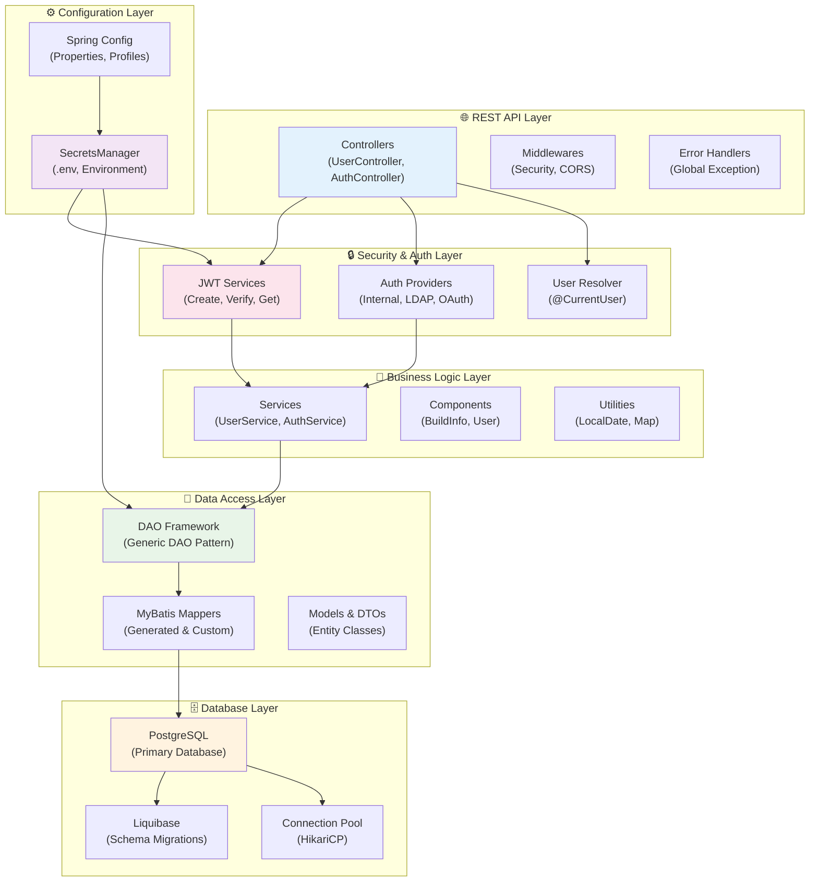
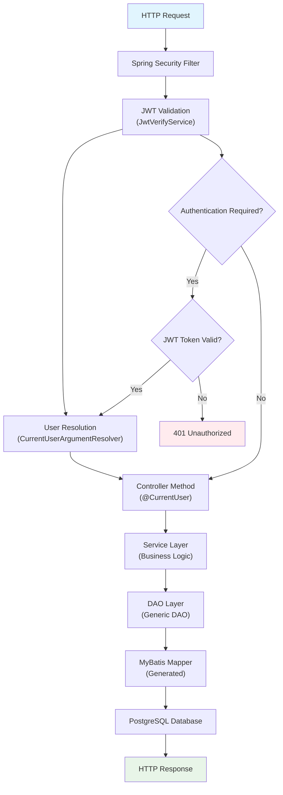

# Framework Overview

The ProLinkLi Java Core Framework is a comprehensive Spring Boot-based framework designed for rapid enterprise application development. It provides a modular architecture with built-in authentication, data access, security, and configuration management.

## 🏗️ Architecture Diagram



## 🧩 Core Components

### 🔒 Authentication & Security (`framework.auth`)

The authentication system provides a pluggable architecture for different authentication methods:

- **AuthProviderRegistry**: Central registry for all authentication providers
- **AuthProvider Interface**: Contract for implementing custom authentication methods
- **InternalAuthProvider**: Username/password authentication against the database
- **CurrentUserArgumentResolver**: Automatic injection of authenticated user in controllers
- **JWT Integration**: Seamless integration with JWT token system

**Key Features:**
- ✅ Pluggable authentication providers
- ✅ Automatic user resolution in controllers
- ✅ Built-in internal authentication
- ✅ Extensible for OAuth, LDAP, SSO
- ✅ Thread-safe user context

### 💾 Data Access Layer (`framework.db`)

A powerful generic DAO pattern that automatically integrates with MyBatis:

- **Dao<T, PK>**: Generic DAO implementation with type safety
- **DaoFactory**: Factory pattern for creating and caching DAO instances
- **IParentDao**: Interface defining standard CRUD operations
- **DbModel**: Base interface for all database entities
- **DbExample Plugin**: Custom MyBatis plugin for enhanced query building

**Key Features:**
- ✅ Zero-configuration DAO creation
- ✅ Type-safe database operations
- ✅ Automatic MyBatis mapper integration
- ✅ Built-in caching and performance optimization
- ✅ Support for complex queries with Example classes
- ✅ Batch operations support

### 🎫 JWT System (`framework.jwt`)

Comprehensive JWT token management system:

- **JwtCreateService**: Token generation and persistence
- **JwtVerifyService**: Token validation and user extraction
- **JwtGetService**: Token retrieval and management
- **JwtSaveService**: Token persistence operations
- **JwtUtil**: Utility functions for JWT operations
- **AuthToken**: Token model with access and refresh tokens

**Key Features:**
- ✅ Access and refresh token support
- ✅ Database-backed token validation
- ✅ Automatic token expiration handling
- ✅ Secure token signing and verification
- ✅ User context extraction from tokens

### ⚙️ Configuration System (`framework.config`)

Modern configuration management with environment-based secrets:

- **SecretsManager**: Centralized secret management
- **SecretsConfig**: Configuration for loading environment variables
- **SecretProperties**: Type-safe configuration properties
- **Environment-based loading**: `.env` files for development, environment variables for production

**Key Features:**
- ✅ Environment-specific configuration
- ✅ Secure secret management
- ✅ Development `.env` file support
- ✅ Production environment variable support
- ✅ Type-safe configuration access
- ✅ Fallback configuration hierarchy

### 🛠️ Utilities (`framework.util`)

Common utilities and helper functions:

- **LocalDateUtil**: Date and time manipulation utilities
- **MapUtil**: Map operations and transformations
- **Additional utilities** for common operations

## 🔄 Request Flow



## 🏛️ Architectural Principles

### 1. **Separation of Concerns**
Each layer has a distinct responsibility:
- Controllers handle HTTP concerns
- Services contain business logic
- DAOs manage data access
- Models represent data structures

### 2. **Dependency Injection**
- Constructor injection for required dependencies
- Interface-based programming for testability
- Spring's IoC container manages component lifecycle

### 3. **Type Safety**
- Generic DAO pattern ensures compile-time type checking
- Strongly-typed configuration properties
- Type-safe JWT operations

### 4. **Security First**
- JWT-based authentication
- Secure secret management
- Input validation at all layers
- SQL injection prevention through parameterized queries

### 5. **Developer Experience**
- Zero-configuration DAO creation
- Automatic code generation
- Hot reload in development
- Comprehensive error messages

## 🔌 Extensibility Points

### Custom Authentication Providers
```java
@Component
public class LdapAuthProvider implements AuthProvider {
    @Override
    public String getProviderName() {
        return "LDAP";
    }
    
    @Override
    public Boolean authenticate(Map<String, Object> credentials) {
        // Implement LDAP authentication
    }
}
```

### Custom DAO Operations
```java
public interface UserMapper extends UserDbMapper {
    List<User> findActiveUsersWithRoles();
    int updateLastLoginTime(@Param("userId") Long userId);
}
```

### Custom Configuration
```java
@ConfigurationProperties(prefix = "app.custom")
public class CustomProperties {
    private String apiKey = "${CUSTOM_API_KEY:}";
    // Additional properties
}
```

## 📊 Performance Characteristics

- **DAO Caching**: DAO instances are cached for optimal performance
- **Connection Pooling**: Built-in PostgreSQL connection pooling
- **JWT Validation**: Fast in-memory token validation with database fallback
- **Query Optimization**: MyBatis-generated optimized SQL queries
- **Lazy Loading**: Components loaded only when needed

## 🎯 Best Practices

1. **Use Constructor Injection** for all dependencies
2. **Implement interfaces** for all service classes
3. **Use @Transactional** for multi-operation business logic
4. **Validate inputs** at controller and service boundaries
5. **Handle exceptions** gracefully with proper error responses
6. **Use environment variables** for all sensitive configuration
7. **Write integration tests** for DAO operations
8. **Document public APIs** with comprehensive JavaDoc

## 🔗 Related Documentation

- [Authentication Framework](Authentication-Framework) - Detailed auth system guide
- [DAO Framework](DAO-Framework) - Complete data access documentation
- [JWT System](JWT-System) - JWT implementation details
- [Secret Management](Secret-Management) - Configuration and secrets guide 