# JWT System

The ProLinkLi Framework provides a comprehensive JWT system for secure authentication and authorization.

## 🏗️ JWT Token Lifecycle

```mermaid
sequenceDiagram
    participant User as 👤 User
    participant Auth as 🔐 AuthController
    participant Provider as 🛡️ AuthProvider
    participant JWT as 🎫 JwtCreateService
    participant DB as 💾 Database
    participant API as 📡 Protected API
    participant Verify as 🔍 JwtVerifyService
    
    Note over User,Verify: Login Flow
    User->>Auth: POST /login (credentials)
    Auth->>Provider: authenticate(credentials)
    Provider->>DB: validate user/password
    DB-->>Provider: user found ✅
    Provider-->>Auth: authentication success
    
    Auth->>JWT: createJwtTokenForUser(user)
    JWT->>JWT: generate access + refresh tokens
    JWT->>DB: store tokens
    JWT-->>Auth: AuthorizedUser (with tokens)
    Auth-->>User: 200 OK + JWT tokens
    
    Note over User,Verify: API Request Flow
    User->>API: GET /profile (Authorization: Bearer <token>)
    API->>Verify: verifyToken(token)
    Verify->>DB: check token exists & valid
    DB-->>Verify: token valid ✅
    Verify->>Verify: extract user from token
    Verify-->>API: user context
    API->>API: process request with @CurrentUser
    API-->>User: 200 OK + user profile
    
    Note over User,Verify: Token Expiry/Revocation
    User->>API: GET /data (expired token)
    API->>Verify: verifyToken(expired_token)
    Verify->>Verify: check expiration
    Verify-->>API: token expired ❌
    API-->>User: 401 Unauthorized
```



## 🏗️ Core Components

### JwtCreateService

Handles JWT token generation and persistence:

```java
@Service
public class JwtCreateService {
    
    public AuthToken createJwtToken(Map<String, Object> claims);
    public AuthorizedUser createJwtTokenForUser(User user, Map<String, Object> claims);
}
```

### JwtVerifyService

Handles token validation and user extraction:

```java
@Service
public class JwtVerifyService {
    
    public boolean verifyToken(String token, HttpServletResponse response);
    public Long extractUserId(String token);
    public List<String> extractAuthorities(String token);
}
```

### AuthToken Model

```java
public class AuthToken {
    private String accessToken;
    private String refreshToken;
    private Date expiresAt;
}
```

## 🚀 Usage Examples

### Token Creation During Login

```java
@PostMapping("/login")
public ResponseEntity<AuthResponse> login(@RequestBody LoginRequest request) {
    AuthProvider provider = authRegistry.getProvider("PASSWORD");
    
    if (provider.authenticate(credentials)) {
        User user = userService.getUserByUsername(request.getUsername());
        
        Map<String, Object> claims = Map.of(
            "loginTime", System.currentTimeMillis()
        );
        
        AuthorizedUser authorizedUser = jwtCreateService.createJwtTokenForUser(user, claims);
        return ResponseEntity.ok(new AuthResponse(authorizedUser));
    }
    
    return ResponseEntity.status(HttpStatus.UNAUTHORIZED).build();
}
```

### Using @CurrentUser

```java
@GetMapping("/profile")
public ResponseEntity<UserProfile> getProfile(@CurrentUser User user) {
    // User is automatically injected from JWT token
    UserProfile profile = userService.getProfile(user.getId());
    return ResponseEntity.ok(profile);
}
```

## 🔐 Security Features

### Database-Backed Validation

Tokens are validated against the database for security:

```java
private boolean isJwtTokenActive(String token) {
    // 1. Validate token structure and expiration
    if (!isJwtTokenValid(token)) return false;
    
    // 2. Extract user ID from token
    Long userId = extractUserId(token);
    
    // 3. Check if token exists in database
    Set<AuthToken> storedTokens = jwtGetService.getJwtToken(userId);
    boolean tokenExists = storedTokens.stream()
        .anyMatch(storedToken -> storedToken.getAccessToken().equals(token));
    
    // 4. Verify user still exists
    User user = userGetService.getUserById(userId);
    return tokenExists && user != null;
}
```

#### JWT Validation Process

```mermaid
flowchart TD
    A["🎫 Incoming JWT Token<br/>(from Authorization header)"] --> B{"🔍 Token Structure Valid?<br/>(has 3 parts, proper format)"}
    
    B -->|❌ No| C["🚫 Return false<br/>(Invalid format)"]
    B -->|✅ Yes| D["🔐 Parse JWT Claims<br/>(using secret key)"]
    
    D --> E{"⏰ Token Not Expired?<br/>(check exp claim)"}
    E -->|❌ No| F["🚫 Return false<br/>(Token expired)"]
    E -->|✅ Yes| G["👤 Extract User ID<br/>(from userId claim)"]
    
    G --> H{"🆔 User ID Valid?<br/>(not null, > 0)"}
    H -->|❌ No| I["🚫 Return false<br/>(Invalid user ID)"]
    H -->|✅ Yes| J["🗄️ Query Database<br/>(jwt_token table)"]
    
    J --> K{"💾 Token Exists in DB?<br/>(access_token match)"}
    K -->|❌ No| L["🚫 Return false<br/>(Token revoked/not found)"]
    K -->|✅ Yes| M["👤 Query User Table<br/>(verify user exists)"]
    
    M --> N{"🧑 User Still Exists?<br/>(user not deleted)"}
    N -->|❌ No| O["🚫 Return false<br/>(User deleted)"]
    N -->|✅ Yes| P["✅ Return true<br/>(Token valid & active)"]
    
    %% Success Path
    P --> Q["🎯 Inject @CurrentUser<br/>(in controller method)"]
    
    %% Error Styling
    style C fill:#ffcdd2
    style F fill:#ffcdd2
    style I fill:#ffcdd2
    style L fill:#ffcdd2
    style O fill:#ffcdd2
    
    %% Success Styling
    style P fill:#c8e6c9
    style Q fill:#e8f5e8
    
    %% Process Styling
    style A fill:#e3f2fd
    style J fill:#fff3e0
    style M fill:#fff3e0
```



### Token Revocation

```java
public void revokeUserTokens(Long userId) {
    jwtSaveService.deleteTokensByUserId(userId);
}

public void revokeSpecificToken(String accessToken) {
    jwtSaveService.deleteTokenByAccessToken(accessToken);
}
```

## 🛠️ Configuration

JWT configuration uses the secret management system:

```properties
jwt.secret=${JWT_SECRET}
jwt.expiration-hours=${JWT_EXPIRATION_HOURS:24}
jwt.issuer=${JWT_ISSUER:prolinkli-core}
```

## 🧪 Testing

### Unit Testing

```java
@Test
void createJwtToken_ValidClaims_ReturnsTokens() {
    when(secretsManager.getJwtSecret()).thenReturn("test-secret-key");
    
    Map<String, Object> claims = Map.of("userId", 1L);
    AuthToken result = jwtCreateService.createJwtToken(claims);
    
    assertThat(result.getAccessToken()).isNotNull();
    assertThat(result.getRefreshToken()).isNotNull();
}
```

## 🎯 Best Practices

1. Use secure secrets (minimum 256 bits)
2. Set appropriate expiration times
3. Validate tokens against database
4. Implement proper token revocation
5. Log authentication events for audit

## 🔗 Related Documentation

- [Authentication Framework](Authentication-Framework)
- [Secret Management](Secret-Management)
- [User Management](User-Management) 