# Secret Management

The ProLinkLi Framework provides a robust secret management system for secure handling of sensitive configuration values.

## 🏗️ Configuration Priority Flow

```mermaid
flowchart TD
    A["🚀 Application Startup"] --> B["📋 SecretsManager.getSecret('JWT_SECRET')"]
    
    B --> C{"🔍 Check System Environment<br/>(System.getenv('JWT_SECRET'))"}
    C -->|Found| D["✅ Use System Environment Value<br/>(Production Priority)"]
    C -->|Not Found| E{"📁 Check .env File<br/>(dotenv.get('JWT_SECRET'))"}
    
    E -->|Found| F["✅ Use .env File Value<br/>(Development Priority)"]
    E -->|Not Found| G{"⚙️ Check Spring Properties<br/>(environment.getProperty('JWT_SECRET'))"}
    
    G -->|Found| H["✅ Use Spring Properties Value<br/>(Fallback)"]
    G -->|Not Found| I{"❓ Is Secret Required?<br/>(getRequiredSecret vs getSecret)"}
    
    I -->|Required| J["❌ Throw IllegalStateException<br/>('Required secret not found')"]
    I -->|Optional| K["🔄 Return Default Value<br/>(if provided)"]
    
    D --> L["🎯 Return Secret Value"]
    F --> L
    H --> L
    K --> L
    
    subgraph "🌍 Environment Types"
        M["🏠 Development<br/>(.env file priority)"]
        N["☁️ Production<br/>(System env priority)"]
        O["🧪 Testing<br/>(Properties priority)"]
    end
    
    style D fill:#c8e6c9
    style F fill:#fff3e0
    style H fill:#e1f5fe
    style J fill:#ffcdd2
    style L fill:#e8f5e8
```



## 🏗️ Core Components

### SecretsManager

Central service for accessing secrets with priority hierarchy:

```java
@Component
public class SecretsManager {
    
    public String getSecret(String key);
    public String getRequiredSecret(String key);
    public String getJwtSecret();
    public String getDbPassword();
    public boolean isDevelopment();
}
```

### SecretsConfig

Configuration class for secret loading:

```java
@Configuration
public class SecretsConfig {
    
    @Bean
    public Dotenv dotenv() {
        return Dotenv.configure()
            .directory("./")
            .ignoreIfMissing()
            .load();
    }
}
```

## 🚀 Usage Examples

### Basic Usage

```java
@Service
public class MyService {
    
    @Autowired
    private SecretsManager secretsManager;
    
    public void doSomething() {
        String apiKey = secretsManager.getRequiredSecret("API_SECRET_KEY");
        String logLevel = secretsManager.getSecret("LOG_LEVEL", "INFO");
        boolean isDev = secretsManager.isDevelopment();
    }
}
```

### JWT Integration

```java
@Service
public class JwtCreateService {
    
    private final SecretsManager secretsManager;
    
    public JwtCreateService(SecretsManager secretsManager) {
        this.secretsManager = secretsManager;
    }
    
    private String createToken(Map<String, Object> claims, Long expiration) {
        return Jwts.builder()
            .issuer(secretsManager.getJwtIssuer())
            .signWith(JwtUtil.getHmacShaKey(secretsManager.getJwtSecret()))
            .compact();
    }
}
```

## 🛠️ Setup

### Development Setup

1. Copy template: `cp env.template .env`
2. Edit .env with your values
3. Start application

### Production Setup

Set environment variables:

```bash
export DB_PASSWORD=secure_password
export JWT_SECRET=production-secret-key
export ENVIRONMENT=production
```

## 🔒 Security Features

### Priority Order

1. System Environment Variables (production)
2. .env File (development)  
3. Spring Properties (fallback)

### Required vs Optional

```java
// Required - throws exception if missing
String jwtSecret = secretsManager.getRequiredSecret("JWT_SECRET");

// Optional - uses default if missing
String logLevel = secretsManager.getSecret("LOG_LEVEL", "INFO");
```

## 🎯 Best Practices

1. Use UPPER_CASE_WITH_UNDERSCORES for env var names
2. Group secrets with prefixes: `DB_*`, `JWT_*`
3. Never log actual secret values
4. Validate secret requirements on startup
5. Use system env vars in production

## 🔗 Related Documentation

- [Framework Overview](Framework-Overview)
- [Authentication Framework](Authentication-Framework)
- [JWT System](JWT-System) 